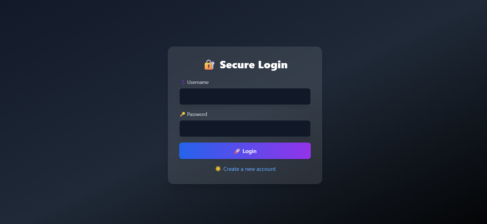
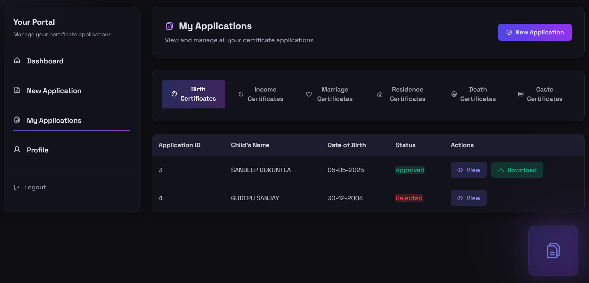
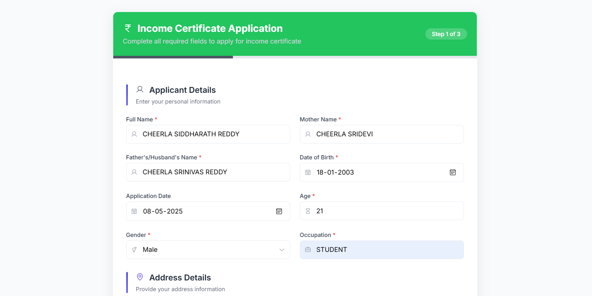
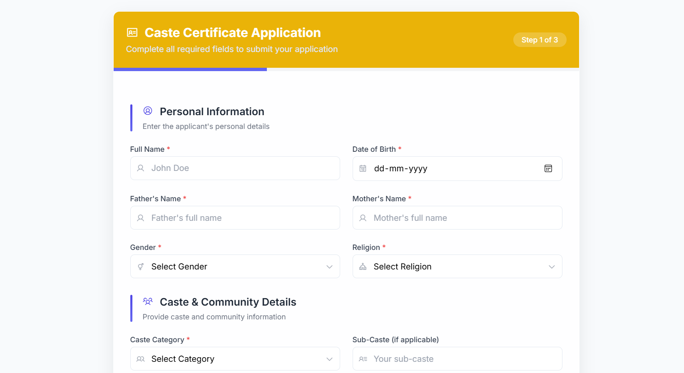
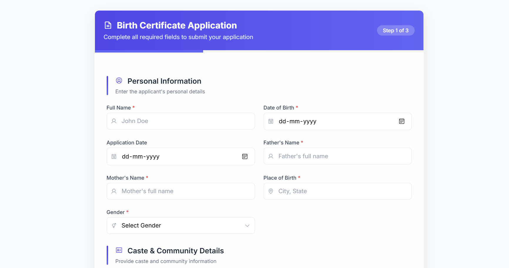
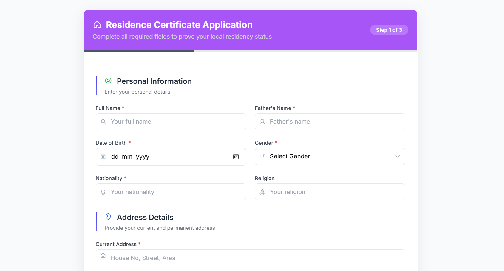
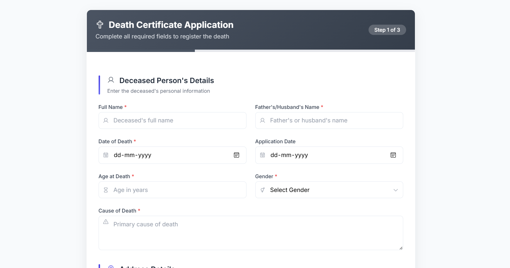
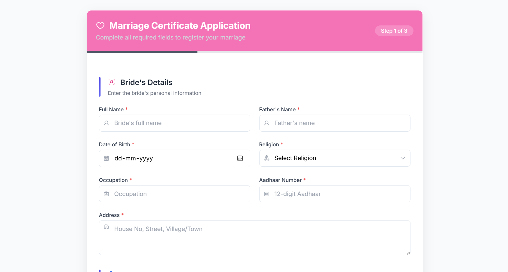
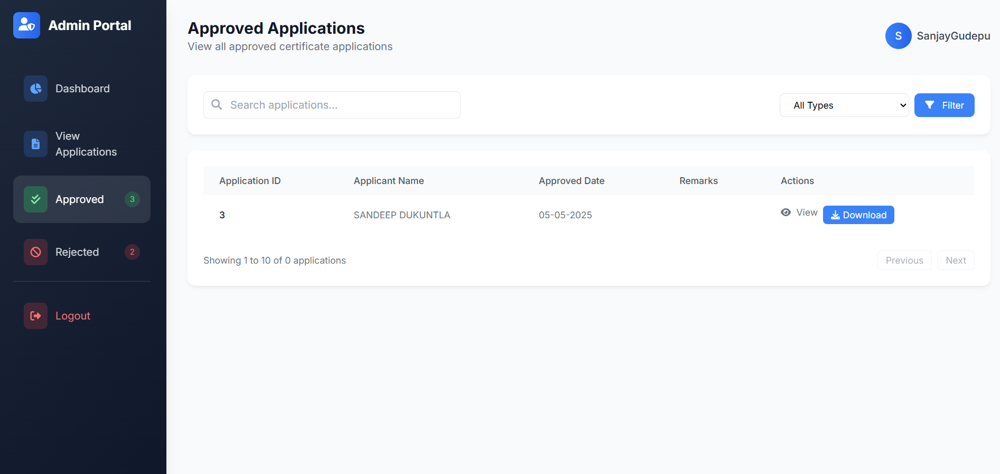
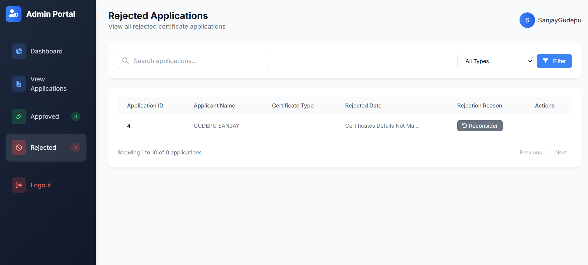

# 🎓 Certificate Issuance Monitoring System

The **Certificate Issuance Monitoring System** is a web-based application built with **Spring Boot** to streamline the request, review, and issuance of various types of certificates. The system provides two dashboards: one for the **Applicant** and another for the **Admin**, enabling a seamless process for managing applications and issuing certificates digitally.

---

## 🚀 Key Features

### 👤 Applicant Dashboard
- Submit applications for:
  - Income Certificate
  - Caste Certificate
  - Residence Certificate
  - Marriage Certificate
  - Birth Certificate
  - Death Certificate
- View the application status as:
  - ✅ Approved
  - ❌ Rejected (with remarks)
  - ⏳ Pending
- Once approved, download the issued certificate.
- View submitted application forms.

### 🛡️ Admin Dashboard
- View and manage all submitted applications.
- Verify and process each application.
- Approve applications and issue certificates.
- Reject applications with appropriate remarks.
- Access a list of:
  - Approved certificates
  - Rejected applications

---

## 🛠️ Tech Stack

- **Backend:** Java, Spring Boot, Spring MVC, Spring Data JPA , Hiberanate(ORM)
- **Frontend:** HTML, CSS, Thymeleaf
- **Database:** MySQL
- **Build Tool:** Maven

---

## 📁 Project Structure

```
Certificate_Issuance_Monitoring_System/
├── src/
│   ├── main/
│   │   ├── java/
│   │   │   └── com/example/certificate/
│   │   │       ├── controller/
│   │   │       ├── model/
│   │   │       ├── repository/
│   │   │       └── service/
│   │   └── resources/
│   │       ├── static/
│   │       ├── templates/
│   │       └── application.properties
├── pom.xml
└── README.md
```

---

## ⚙️ Configuration

Before running the project, update the database configuration in:

`src/main/resources/application.properties`

```properties
spring.datasource.url=jdbc:mysql://localhost:3306/certificate_system
spring.datasource.username=your_mysql_username
spring.datasource.password=your_mysql_password
spring.jpa.hibernate.ddl-auto=update
spring.jpa.show-sql=true
```

---

## 🧪 How to Run

### 1. Clone the Repository

```bash
git clone https://github.com/yourusername/Certificate_Issuance_Monitoring_System.git
cd Certificate_Issuance_Monitoring_System
```

### 2. Build and Run the Project

```bash
./mvnw spring-boot:run
```

### 3. Access the Application

- **Applicant Dashboard:** [http://localhost:8080/applicant](http://localhost:8080/applicant)
- **Admin Dashboard:** [http://localhost:8080/admin](http://localhost:8080/admin)

---

## 📷 Output Screenshots


```markdown















```


---

## 🤝 Contributing

Contributions are welcome! Please open an issue or submit a pull request for any improvements or bug fixes.

---

## 📄 License


This project is licensed under the MIT License. See the [LICENSE](./LICENSE.md) file for details.

